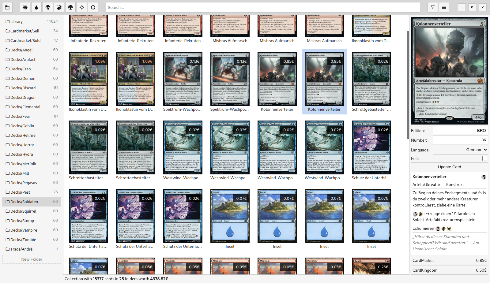
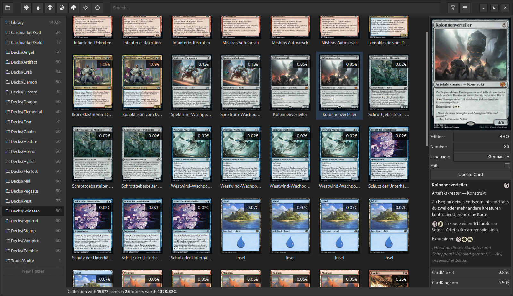

# macaco

Macaco stands for **Ma**gic **Ca**rd **Co**llection and is a utility that helps you to digitalize and organize your [Magic: The Gathering](https://magic.wizards.com/) collection. Each card in your collection is represented as a single file and is grouped by folders. This allows you to browse, sort, backup and work with your collection using any file manager of your choice.

Macaco can add new cards to your library by simply typing the `set` and the `number` of the card into the side panel. It will then automatically begin to download an image of the card from [Scryfall](https://scryfall.com/) and saves it into your library. An alternative approach would be to scan your cards via [Delver Lens](https://www.delverlab.com/), create a backup and import it into your macaco library.

## Screenshot

|                   Main Window (Light)                     |                   Main Window (Dark)                   |
| :-------------------------------------------------------: | :----------------------------------------------------: |
|  |  |

## Download

> **This project is in early development. Use at your own risk.**

All download links can be found on the **[Release Page](https://github.com/shagu/macaco/releases/latest)** for the following platforms:

* Linux as AppImage (macaco-X.X.X-linux.AppImage)
* MacOS as Apple Disk Image (macaco-X.X.X-mac.dmg)
* Windows as portable Executable (macaco-X.X.X-win.exe)

## Thanks

* **[MTGJSON](https://mtgjson.com/)** - The main source of all card data used in this project
* **[MTG Fandom](https://mtg.fandom.com/)** - Many MTG related icons are taken from there
* **[Scryfall](https://scryfall.com/)** - All card images and previews are downloaded from there
* **[Delver Lens](https://www.delverlab.com/)** - A supported card scanning app for android devices
